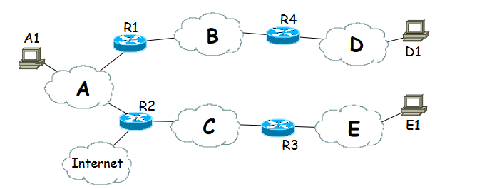

# Práctica 14. ARP

## Ejercicio 1.



**a. Si suponemos que inicialmente las cachés ARP asociadas a los adaptadores están vacías, indica cómo quedarán las cachés ARP de todos los adaptadores después de que A1 envíe un mensaje a D1 y después de que D1 le conteste a A1.**

Solo se modifican las siguientes cachés ARP:

Tabla ARP de A1
| IP | MAC |
|--|--|
| IP(R1A) | MAC(R1A) |

Tabla ARP de R1A
| IP | MAC |
|--|--|
| IP(A1) | MAC(A1) |

Tabla ARP de R1B
| IP | MAC |
|--|--|
| IP(R4B) | MAC(R4B) |

Tabla ARP de R4B
| IP | MAC |
|--|--|
| IP(R1B) | MAC(R1B) |

Tabla ARP de R4D
| IP | MAC |
|--|--|
| IP(D1) | MAC(D1) |

Tabla ARP de D1
| IP | MAC |
|--|--|
| IP(R4D) | MAC(R4D) |

**b. Si a continuación, E1 envía un mensaje a D1, ¿cómo quedan las cachés ARP?**

Se modificarían las siguientes tablas de ARP:

Tabla ARP de E1
| IP | MAC |
|--|--|
| IP(R3E) | MAC(R3E) |

Tabla ARP de R3E
| IP | MAC |
|--|--|
| IP(E1) | MAC(E1) |

Tabla ARP de R3C
| IP | MAC |
|--|--|
| IP(R2C) | MAC(R2C) |

Tabla ARP de R2C
| IP | MAC |
|--|--|
| IP(R3C) | MAC(R3C) |

Tabla ARP de R2A
| IP | MAC |
|--|--|
| IP(R1A) | MAC(R1A) |

Tabla ARP de R1A
| IP | MAC |
|--|--|
| IP(A1) | MAC(A1) |
| IP(R2A) | MAC(R2A) |

## Ejercicio 2.

Resultados diferentes en función del equipo donde se ejecute.

```bash
$  ip a              # Bash
>_ ipconfig /all    # Windows
```

## Ejercicio 3.

**a. ¿Qué tipo de direccionamiento se utiliza en el nivel de transporte? ¿Y en el nivel de red?**

En el nivel de transporte se utiliza direccionamiento IP, mientras que en niveles inferiores, se utiliza direccionamiento físico (direcciones MAC).

**b. Expande la información relacionada con el nivel de enlace (Ethernet) ¿Cuál es la dirección física origen? ¿Y la dirección física destino?**

- Origen: Dirección física del adaptador de red de mi equipo
- Destino: Dirección física del adaptador del router con el que salgo a internet

**c. De acuerdo a lo explicado en las secciones anteriores, ¿a quién piensas que pertenece esta última dirección física?**

Al router de mi red (NAT)

**d. Observa que Wireshark expresa las direcciones físicas en dos formatos. ¿Qué dígitos identifican al fabricante del adaptador? ¿Qué código identifica a los fabricantes que te aparecen?**

Los 6 primeros dígitos hexadecimales, es decir, los tres primeros pares.

**e. En la cabecera de Ethernet aparece un campo más que indica el Tipo. ¿Qué se identifica con este campo? ¿Qué valor tiene en nuestro caso y a quién identifica?**

Este campo identifica el protocolo del nivel de red que se va a utilizar, en este caso, IPv4.

## Ejercicio 4.

La caché ARP varía en función del equipo desde el que se trabaja.

Para acceder a esta información ejecutar

```bash
$  ip n     # Bash
>_ arp -a   # Windows
```

En mi caso, el contenido de la caché arp es:

| Dirección de Internet | Dirección física | Tipo |
|--|--|--|
| IP(ROUTER NAT) | MAC(ROUTER NAT) | DINÁMICO |
| 255.255.255.255 | FF-FF-FF-FF-FF-FF | ESTÁTICO |

Siendo la primera la traducción de direcciones del router NAT de mi red y la segunda las direcciones de difusión.

## Ejercicio 5.

En mi caso no encuentro la dirección física de www.upc.es puesto que mi equipo no está conectado a internet directamente y solo debe preocuparse por la dirección física del router que da acceso a internet, al que debe envíar todas las tramas de red.

Tampoco aparece la direción del servidor DNS ya que este también se encuentra fuera del NAT.